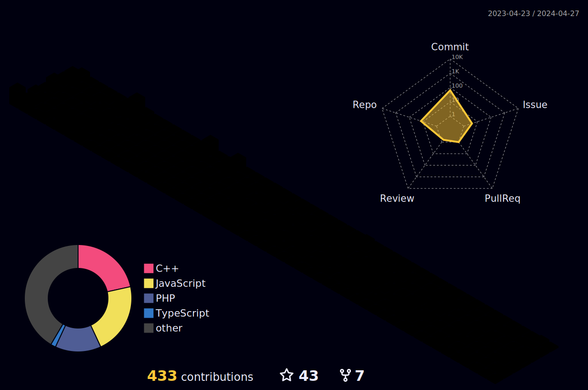

  

---

# 👨‍💻 About Me               

### Hi! I'm <b>Naeem Akram</b>, a passionate Mern Stack Developer from <b>Lahore, Pakistan 🇵🇰</b>.

 - 💼 Mern Stack Developer | Python Automation Expert  
 - 🧠 Solved **500+ LeetCode problems**  
 - 📜 Certified in CS50, HackerRank (Python, JavaScript, Problem Solving)  
 - 📫 Reach me: [LinkedIn](https://www.linkedin.com/in/naeem-akram-7a48a01ba/) | [Email](mailto:maliknaeemakram308@gmail.com)  
 - 🔭 Currently diving deeper into **Backend**, **Frontend**, and **system design**

---

# 🛠️ Tech Stack

## 🚀 Frontend

## ⚙️ Backend

## 🧩 Databases

## 🛠 Tools & Platforms

---

# 🌐 My Contributions & Activity

  

  

---

# 📈 GitHub Stats

  

    
  
  
    

  
  
  

---

# 📜 Certifications

###  - 🎓 <b>CS50 - Introduction to Computer Science (Harvard University)</b>  
###  - 🛠 <b>HackerRank Skills Verified</b>: Python, JavaScript, Problem Solving  
###  - 🧠 <b>500+ LeetCode Problems Solved</b>

# 

  

## 🧠 [Befer.co (AI-Powered Tool)](https://befer.co)
> Contributed to real-time AI tools, workflows, and branding.

## 🔧 [CS50 Projects](https://github.com/NaeemAbdullahAkram/CS50x)
> Harvard’s CS50 problem sets include Speller, Sort, DNA, and SQL-based apps.

# 🌍 Let's Connect

  
  
  
  
  

---

