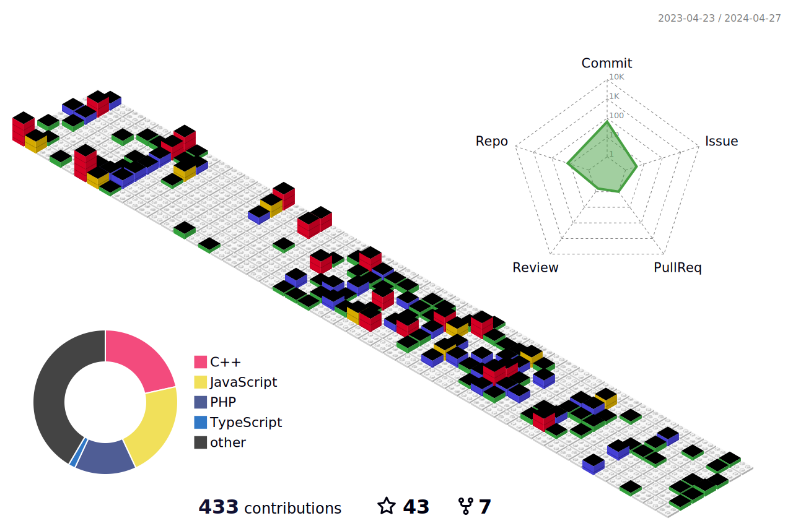
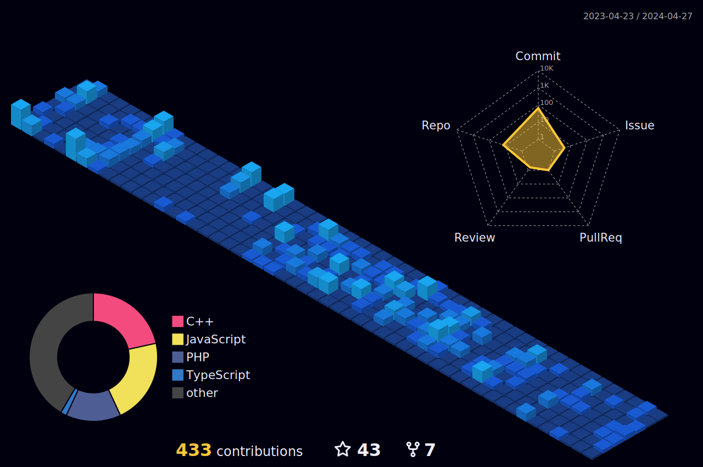

<h1 align="center">Hi 👋, I'm Naeem Akram</h1>
<h3 align="center"> Welcome! I'm a passionate AI/ML & Python Devolper based in Lahore, Pakistan.</h3>

 <!--  -->
<pre>
                                       ___           ___           ___       ___       ___     
                                      /\__\         /\  \         /\__\     /\__\     /\  \    
                                     /:/  /        /::\  \       /:/  /    /:/  /    /::\  \   
                                    /:/__/        /:/\:\  \     /:/  /    /:/  /    /:/\:\  \  
                                   /::\  \ ___   /::\~\:\  \   /:/  /    /:/  /    /:/  \:\  \ 
                                  /:/\:\  /\__\ /:/\:\ \:\__\ /:/__/    /:/__/    /:/__/ \:\__\
                                  \/__\:\/:/  / \:\~\:\ \/__/ \:\  \    \:\  \    \:\  \ /:/  /
                                       \::/  /   \:\ \:\__\    \:\  \    \:\  \    \:\  /:/  / 
                                       /:/  /     \:\ \/__/     \:\  \    \:\  \    \:\/:/  /  
                                      /:/  /       \:\__\        \:\__\    \:\__\    \::/  /   
                                      \/__/         \/__/         \/__/     \/__/     \/__/    
</pre>

# About Me:  I am a Software Engineer and Tech Enthusiast
<ul dir="auto">
        <li>
          
🎓 <strong>Formal Education:</strong> Senior year student of Computer Sciences at Lahore Garrison University, Lahore, Pakistan.

        </li>
        <li>
          
🤝 <strong>Wants to work:</strong> I’m available for freelance work.

        </li>
        <li>
          
📝 <strong>Share Knowledge:</strong> I regularly share my work on LinkedIn site.

        </li>
        <li>
          
📫 <strong>How to reach me:</strong> You can contact me at <strong><a
                href="mailto:maliknaeemakram308@gmail.com">maliknaeemakram308@gmail.com</a></strong>.

        </li>
	<li>
		
- 👯 <strong>I am looking</strong> to collaborate on Web Development Projects.

	</li>
	<li>
		
- 📢 <strong>I Love to Code and learn new technologies.</strong> 

	</li>
	<li>
		
- 🥅 <strong>2024 Goals:</strong> Contribute to open source and read self-help books. 

	</li>
      </ul>

	
	
	 

 
## GitHub Stats 📈

    
    
  

## Language Stats 📈
 

  
   

   

  
  
 

## Contribution Graph 📈
 
 
 
 
 
 ## 🏆 GitHub Trophies 
 
<!-- ## Contribution Graph -->
<!-- 
 -->

## Tech Stack

<a href="https://www.cplusplus.com/" target="_blank" rel="noreferrer"> 
<a href="https://docs.microsoft.com/en-us/dotnet/csharp/" target="_blank" rel="noreferrer"> 

 

     

## Let's Connect

	
	
	
 	 
	
	
	 

 

     

  

     

 
